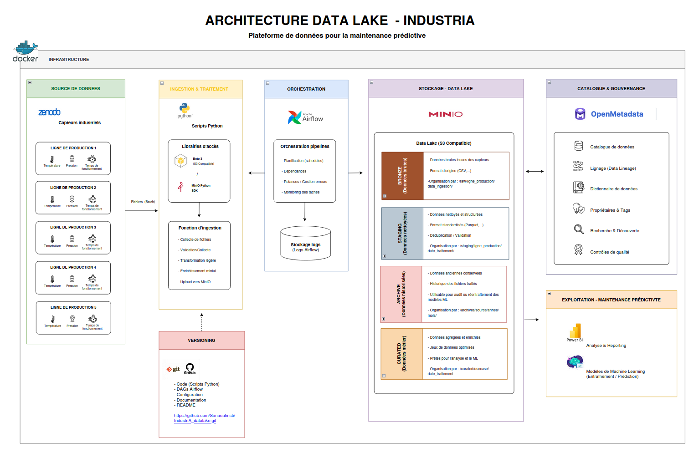

# IndustriA Data Lake

Conception et déploiement d'un data lake pour un équipementier automobile disposant de 5 lignes de production instrumentées de capteurs (température, pression, temps de fonctionnement). Ce projet centralise, structure et gouverne les données de production en vue d'un futur projet de maintenance prédictive.

---

## Contexte

Les 5 lignes de production génèrent des données en continu via des capteurs industriels. Ces données étaient jusqu'alors stockées en vrac, sans structure ni gouvernance, rendant toute exploitation analytique impossible.

Ce projet répond à cette problématique en construisant une infrastructure data complète : ingestion, transformation, stockage en couches, catalogage et gouvernance.

---

## Stack technique

MinIO 2025 — stockage objet compatible S3

Apache Airflow 2.6.3 — orchestration des pipelines

boto3 — interactions avec l'API S3

OpenMetadata 1.2.0 — catalogage et gouvernance

Docker — conteneurisation de l'ensemble

Python 3.12 et 3.9 — scripts d'ingestion et transformation

---

## Architecture en couches

raw — données brutes telles quelles arrivent des capteurs, suppression automatique après 730 jours

staging — données nettoyées et harmonisées, colonnes renommées en minuscules, timestamps normalisés, elapsed_time ajouté si absent, suppression automatique après 730 jours

curated — données prêtes pour l'analyse et le machine learning, Tier 1, données d'entraînement pour la maintenance prédictive, suppression automatique après 730 jours

archive — données expirées conservées indéfiniment pour audit et conformité, Tier 3

---

## Structure du projet

IndustriA_datalake/

dags/

dag_ingestion_raw.py — DAG Airflow upload des CSV vers raw/

dag_harmonisation_staging.py — DAG Airflow transformation vers staging/

data/

LineA_Stable_10K.csv

LineB_Flux.csv

LineC_Turbulent.csv

LineD_SpikeControl.csv

LineE_SmoothRun.csv

docs/

architecture.md — description des 4 couches et justifications

gouvernance.md — politique d'accès, propriétaires, ILM

schemas_analysis.md — analyse des schémas hétérogènes des 5 lignes

infra/

docker-compose.yml — stack complète MinIO, Airflow, MySQL, Elasticsearch, OpenMetadata

ingestion/

explore_csv.py — exploration initiale des CSV

upload_raw.py — upload des CSV vers le bucket raw

check_integrity.py — vérification MD5 des fichiers uploadés

set_policies.py — configuration des policies d'accès S3

set_ilm.py — règles de cycle de vie ILM MinIO

s3_ingestion.yaml — configuration ingestion OpenMetadata via metadata CLI

---

## Prérequis

Docker et Docker Compose installés

Python 3.12 et Python 3.9 installés, Python 3.9 via deadsnakes

Client mc MinIO installé dans /usr/local/bin/

---

## Démarrage

Activer l'environnement virtuel

source .venv/bin/activate

Lancer les services

cd infra

docker compose up -d

Bootstrap OpenMetadata, obligatoire à chaque redémarrage

docker run --rm --network infra_default -e DB_HOST=mysql -e DB_PORT=3306 -e DB_USER=openmetadata -e DB_USER_PASSWORD=openmetadata -e OM_DATABASE=openmetadata_db openmetadata/server:1.2.0 /opt/openmetadata/bootstrap/bootstrap_storage.sh migrate-all 2>&1 | tail -3

docker restart openmetadata

Interfaces disponibles

MinIO Console : http://localhost:9001 — minioadmin / minioadmin

Airflow : http://localhost:8080 — admin / voir logs avec docker logs airflow | grep password

OpenMetadata : http://localhost:8585 — admin / admin

---

## Données sources

Les 5 fichiers CSV proviennent de Zenodo — Polytechnic Institute of Porto / INESC TEC

LineA_Stable_10K.csv — 10 000 lignes, ligne stable, référence

LineB_Flux.csv — 5 000 lignes, flux moyen

LineC_Turbulent.csv — 5 000 lignes, turbulente, elapsed_time absent

LineD_SpikeControl.csv — 5 000 lignes, pics de pression, elapsed_time absent

LineE_SmoothRun.csv — 5 000 lignes, variable, elapsed_time absent

Les colonnes présentent des casses inconsistantes entre les fichiers. La couche staging harmonise ces schémas avant toute exploitation.

---

## Pipelines Airflow

dag_ingestion_raw — upload des 5 CSV depuis data/ vers raw/ dans MinIO, exécution manuelle via l'interface Airflow

dag_harmonisation_staging — lecture depuis raw/, harmonisation des colonnes, dépôt dans staging/, dépend de dag_ingestion_raw

---

## Ingestion OpenMetadata

Créer l'environnement Python 3.9

python3.9 -m venv .venv39

source .venv39/bin/activate

pip install "openmetadata-ingestion==1.2.0.0"

Lancer l'ingestion

metadata ingest -c ingestion/s3_ingestion.yaml

Le token JWT est à récupérer depuis http://localhost:8585/settings/bots dans le bot ingestion-bot et à renseigner dans s3_ingestion.yaml

---

## Comptes de service MinIO

mc alias set minio http://localhost:9000 minioadmin minioadmin

dataanalyst — lecture seule sur curated — usage data scientists / data analyst

dataengineer — lecture et écriture sur raw, staging, curated — usage pipelines

admin — tous droits — usage administration

### Utilisateurs métier OpenMetadata

Comptes de gouvernance et de responsabilité des données :

data-steward — propriétaire du service minio-industriA et des 4 buckets — équipe Gouvernance des Données

chef-ligne-a — propriétaire de LineA — équipe Excellence Industrielle

chef-ligne-bcd — propriétaire de LineB, LineC, LineD — équipe Qualité et Continuité de Production

ingenieur-process — propriétaire de LineE — équipe Ingénierie des Procédés

---

## Règles ILM

mc ilm add --expiry-days 730 minio/raw

mc ilm add --expiry-days 730 minio/staging

mc ilm add --expiry-days 730 minio/curated

---

## Gouvernance

Voir docs/gouvernance.md pour la politique complète d'accès, les propriétaires des données, les équipes métier et les règles de cycle de vie
